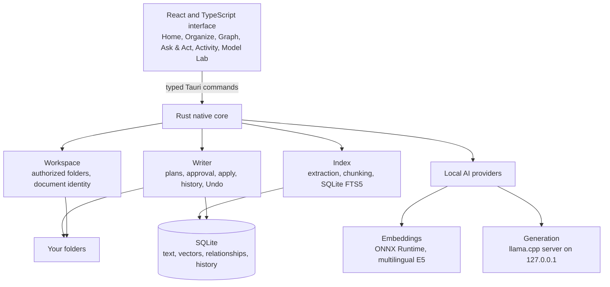

# Folio

**Search. Organize. Summarize.** A private desktop workspace for finding, understanding and managing local documents in English, Filipino and Taglish.

Folio indexes the folders you choose, finds documents by keyword and by meaning, explains how files relate to each other, and proposes exact file changes that you review and approve before anything on disk changes. Documents and AI inference stay on your device. After the one-time model download, the core workflows run without an internet connection.

Students are the first audience: coursework, notes and project files spread across folders. The file workflows are general-purpose and work for anyone.

## What Folio does

| Area              | What you can do                                                                                                                                                                                                                                                  |
| ----------------- | ---------------------------------------------------------------------------------------------------------------------------------------------------------------------------------------------------------------------------------------------------------------- |
| **Search**        | Search an authorized folder by keyword or by meaning. Results show the path, the matching passage and how it matched, and open the reader at that passage. Text PDFs are searchable by page.                                                                     |
| **Summarize**     | Summarize a file from its own passages. Every sentence cites the passage it came from, and a summary that could not read the whole file says so.                                                                                                                 |
| **Organize**      | Analyze a folder, preview suggested renames and moves as an exact plan, approve it, and apply it. Every applied change is recorded and can be undone.                                                                                                            |
| **Relationships** | See explicit links between files and identical copies, each with its evidence. Graph shows them as a map or as an equivalent list, and is fully usable from the keyboard. Connections suggested by a local model will appear labelled "AI" once that work lands. |
| **Ask & Act**     | Ask Olio, the assistant, a question about your files, or ask it to change one. A requested change becomes the same exact preview and approval as Organize, never a silent edit.                                                                                  |
| **Ripple**        | When a change edits a file's text, Folio lists related passages in other files that may also need a look. They are review candidates only; Folio never edits them for you.                                                                                       |
| **Activity**      | A history of every approved change, with Undo for anything that can still be reversed safely.                                                                                                                                                                    |
| **Model Lab**     | Measure installed local models on fixed, labelled tasks and record the conditions, so model choices rest on measurements rather than claims.                                                                                                                     |

### Safety guarantees

- **Nothing changes without approval.** The native core issues a plan with a digest; the UI can only approve that exact plan, and a stale or altered plan is refused.
- **Original files stay where they are.** Folio stores its index, history and models in the operating system's application-data folder, not in your folders.
- **Undo is checked, not assumed.** Undo previews what it will restore and refuses if a file changed since Folio touched it, so it never overwrites edits made elsewhere.
- **Every AI answer is sourced.** Summaries and answers cite the exact passages they used; a question with no supporting passage gets "insufficient evidence", not a guess.

## Architecture

Folio is a [Tauri 2](https://v2.tauri.app/) desktop application. The interface is a React and TypeScript webview; everything that touches files, the index or models runs in a Rust native core. The webview has no filesystem or shell access of its own. It calls a narrow set of typed native commands.



| Layer       | Location                                                | Responsibility                                                                                                                                                 |
| ----------- | ------------------------------------------------------- | -------------------------------------------------------------------------------------------------------------------------------------------------------------- |
| Interface   | `src/`                                                  | Views, workflows and accessibility. Holds no authority: it displays native plans and results.                                                                  |
| Contracts   | `src/domain/contracts.ts`, `src-tauri/src/contracts.rs` | The frozen boundary between interface and core. Both languages declare the same shapes, pinned by golden fixtures in `fixtures/contracts`.                     |
| Native core | `src-tauri/src/`                                        | Folder authorization, indexing, search, relationships, the writer, history and Undo, and the Tauri command layer.                                              |
| AI core     | `src-tauri/crates/folio-core/`                          | Embeddings, retrieval, grounded summaries, request interpretation, model installation and the Model Lab harness. Pure Rust, testable without a desktop window. |
| Storage     | `src-tauri/migrations/`                                 | SQLite schema, applied in order by version.                                                                                                                    |

**Retrieval.** Text is extracted (TXT, Markdown and text PDFs), split into chunks and indexed in SQLite FTS5 for keyword search. Chunks are embedded with a multilingual model for semantic search. Each embedding space is identified by model, revision, quantization, dimensions and preprocessing, and vectors from different spaces are never compared.

**Generation.** A pinned llama.cpp server runs as a local child process, bound to `127.0.0.1` with a random per-process key. Requests use schema-constrained JSON. Source passages are passed as untrusted data, and citations are validated against the passages actually supplied.

**Changes.** Every file change is an exact plan: target paths, expected content hashes and operations. Approval binds to the plan's digest. The writer applies operations one at a time, records a recoverable history entry for each, and refreshes the index. Deleted files keep their bytes in history so Undo can restore them.

Design decisions are recorded as architecture decision records in [`docs/adr`](docs/adr). The full boundary description is in [`docs/architecture.md`](docs/architecture.md) and [`docs/contracts.md`](docs/contracts.md).

## Local AI models

Models are not bundled with the installer. You download them explicitly inside Folio; each file is pinned to an exact revision and verified by size and SHA-256 before use.

| Role       | Model                 | Source                                                                                                                                                                                 | Format       | License    |
| ---------- | --------------------- | -------------------------------------------------------------------------------------------------------------------------------------------------------------------------------------- | ------------ | ---------- |
| Embeddings | Multilingual E5 small | [`Xenova/multilingual-e5-small`](https://huggingface.co/Xenova/multilingual-e5-small) (from [`intfloat/multilingual-e5-small`](https://huggingface.co/intfloat/multilingual-e5-small)) | ONNX, int8   | MIT        |
| Generation | Qwen3 0.6B            | [`unsloth/Qwen3-0.6B-GGUF`](https://huggingface.co/unsloth/Qwen3-0.6B-GGUF)                                                                                                            | GGUF, Q4_K_M | Apache-2.0 |
| Generation | Qwen3 0.6B            | [`Qwen/Qwen3-0.6B-GGUF`](https://huggingface.co/Qwen/Qwen3-0.6B-GGUF)                                                                                                                  | GGUF, Q8_0   | Apache-2.0 |
| Generation | Qwen3 1.7B            | [`unsloth/Qwen3-1.7B-GGUF`](https://huggingface.co/unsloth/Qwen3-1.7B-GGUF)                                                                                                            | GGUF, Q4_K_M | Apache-2.0 |

Model Lab can also install three **evaluation-only** candidates for measurement. They are not offered as product models, and none has been measured yet: Qwen3.5 0.8B and Qwen3.5 2B (Apache-2.0), and Gemma SEA-LION v4.5 E2B (license metadata under review). See [`docs/model-candidates.md`](docs/model-candidates.md).

## Open-source software

Folio is built on the following open-source projects. Each keeps its own license and notices.

**Runtimes and inference**

| Project                                                                                             | Used for                                  | License                          |
| --------------------------------------------------------------------------------------------------- | ----------------------------------------- | -------------------------------- |
| [llama.cpp](https://github.com/ggml-org/llama.cpp) (build b11524)                                   | Local text generation server              | MIT                              |
| [ONNX Runtime](https://onnxruntime.ai/) via [`ort`](https://github.com/pykeio/ort)                  | Local embedding inference                 | MIT; `ort` is MIT or Apache-2.0  |
| [Hugging Face Tokenizers](https://github.com/huggingface/tokenizers)                                | Embedding model tokenization              | Apache-2.0                       |
| [SQLite](https://www.sqlite.org/) with FTS5, via [`rusqlite`](https://github.com/rusqlite/rusqlite) | Index, vectors, relationships and history | Public domain; `rusqlite` is MIT |

**Desktop and native core**

| Project                                                                                                                                                                                                          | Used for                                                            | License                                         |
| ---------------------------------------------------------------------------------------------------------------------------------------------------------------------------------------------------------------- | ------------------------------------------------------------------- | ----------------------------------------------- |
| [Tauri 2](https://v2.tauri.app/) and `tauri-plugin-dialog`                                                                                                                                                       | Desktop shell, native commands, folder picker                       | Apache-2.0 or MIT                               |
| [`lopdf`](https://github.com/J-F-Liu/lopdf)                                                                                                                                                                      | Text extraction from PDFs                                           | MIT                                             |
| [`reqwest`](https://github.com/seanmonstar/reqwest) with rustls                                                                                                                                                  | Verified model and runtime downloads                                | MIT or Apache-2.0                               |
| [`walkdir`](https://github.com/BurntSushi/walkdir), [`sha2`](https://github.com/RustCrypto/hashes), [`unicode-normalization`](https://github.com/unicode-rs/unicode-normalization), [`serde`](https://serde.rs/) | Folder traversal, content hashes, text normalization, serialization | MIT or Apache-2.0 (`walkdir`: Unlicense or MIT) |

**Interface**

| Project                                                                                                              | Used for                                              | License |
| -------------------------------------------------------------------------------------------------------------------- | ----------------------------------------------------- | ------- |
| [React](https://react.dev/)                                                                                          | User interface                                        | MIT     |
| [d3-force](https://github.com/d3/d3-force)                                                                           | Graph layout                                          | ISC     |
| [Lucide](https://lucide.dev/)                                                                                        | Icons                                                 | ISC     |
| [Manrope](https://github.com/sharanda/manrope) and [DM Sans](https://github.com/googlefonts/dm-fonts) via Fontsource | Typefaces from the brand kit, bundled for offline use | OFL-1.1 |

**Development and testing**

| Project                                                     | Used for                       | License    |
| ----------------------------------------------------------- | ------------------------------ | ---------- |
| [Vite](https://vite.dev/) and [Vitest](https://vitest.dev/) | Build and unit tests           | MIT        |
| [TypeScript](https://www.typescriptlang.org/)               | Type checking                  | Apache-2.0 |
| [Playwright](https://playwright.dev/)                       | Browser journey tests          | Apache-2.0 |
| [axe-core](https://github.com/dequelabs/axe-core)           | Automated accessibility checks | MPL-2.0    |
| [Prettier](https://prettier.io/)                            | Formatting                     | MIT        |

## Getting started

### Requirements

- Node.js 22.12 or newer, and npm
- For the desktop app: Rust and the [Tauri prerequisites](https://v2.tauri.app/start/prerequisites/) for your operating system

### Run the browser preview

The preview runs the interface with synthetic sample files. It cannot read or change your folders and does not run models.

```bash
npm ci
npm run dev
```

### Run the desktop app

```bash
npm ci
npm run tauri dev
```

Build the Windows app on Windows and the macOS app on macOS. WSL can run the interface and core checks but does not verify a Windows build.

### Checks

```bash
npm run format:check
npm run check
npm test
npm run build
cargo test --manifest-path src-tauri/Cargo.toml
```

`npm run test:e2e` runs the browser journeys in Chromium against a simulated native core.

### Installers

The **Installer preparation** workflow (`.github/workflows/packaging.yml`) is run manually and builds a Windows x64 installer and a macOS Apple Silicon disk image, with SHA-256 checksums. These test builds are not code-signed:

- **Windows:** if SmartScreen appears, choose **More info**, then **Run anyway**.
- **macOS:** after moving Folio to Applications, run `xattr -dr com.apple.quarantine /Applications/Folio.app`, or allow it under **System Settings**, **Privacy & Security**.

See [`docs/packaging.md`](docs/packaging.md) and [`docs/setup.md`](docs/setup.md).

## Project status

Folio is in active development and has not had a release. The interface, native core and local AI providers are implemented and tested in CI on Windows and macOS. Still pending: verification of the installed app on clean target machines, measured model quality and memory use on an 8 GB device, and code signing. [`docs/status.md`](docs/status.md) records exactly what has and has not been verified.

## Repository layout

```text
src/                          React interface, domain contracts and adapters
src-tauri/src/                Native core and Tauri commands
src-tauri/crates/folio-core/  Local AI, retrieval and Model Lab (pure Rust)
src-tauri/migrations/         SQLite schema
src-tauri/resources/          Pinned model and runtime manifests
fixtures/                     Synthetic English, Filipino and Taglish documents, and contract fixtures
e2e/                          Browser journey tests and the simulated native core
docs/                         Product scope, architecture, contracts, decisions and status
```

## Contributing

Start with [`AGENTS.md`](AGENTS.md), the [glossary](GLOSSARY.md), the [product scope](docs/product.md) and the [plan](docs/plan.md). Contract changes are announced before they merge, and new architecture decisions go in [`docs/adr`](docs/adr). The repository contains only synthetic documents: keep real documents, model files, local databases and secrets out of Git.

## License

Folio is released under the [MIT License](LICENSE). Models, runtimes and third-party libraries keep their own licenses and notices.
