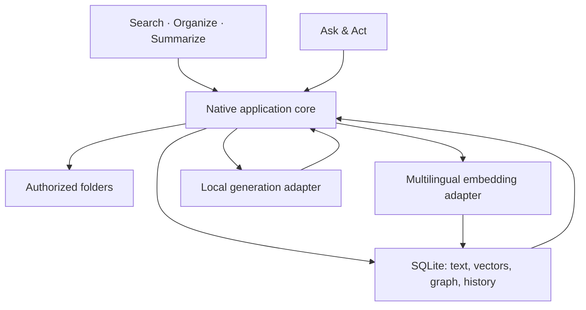

# Architecture

## Chosen shape

One repository contains the desktop UI, native core, shared contracts, fixtures, and docs. The target app uses Tauri 2, React/TypeScript, a Rust core, and SQLite with FTS5. The UI calls a narrow native command interface; the native core owns folder authorization, file reads/writes, persistence, and local inference lifecycle.

## Module boundaries

| Module        | Owns                                                                              | Does not own                                                     |
| ------------- | --------------------------------------------------------------------------------- | ---------------------------------------------------------------- |
| UI            | SOS entry points, file selection, source views, graph, preview, approval controls | Unrestricted filesystem access or authoritative approval records |
| Workspace     | Native folder picker, authorized roots, document identity, containment checks     | Model decisions                                                  |
| Indexing      | Extraction, chunking, content hashes, incremental invalidation                    | Original document copies                                         |
| Retrieval     | FTS5 + semantic candidate search, embedding-space isolation                       | Truth of generated answers                                       |
| Relationships | Typed edges, source evidence, confidence/provenance                               | Automatic edits to neighboring files                             |
| Actions       | Exact plans, expiry, current-file checks, approval, apply, history, undo          | Arbitrary generated shell commands                               |
| Providers     | Separate embedding and generation interfaces, local runtime lifecycle             | Direct filesystem mutation                                       |
| Model Lab     | Actual fixed-task results and measurement conditions                              | Synthetic performance claims                                     |

`src/domain/contracts.ts` is the initial cross-track boundary. Native serialization uses camelCase. Keep operation identities and source locations stable across adapters.

## Local AI

Embedding candidate: quantized multilingual-E5-small through an ONNX-compatible local adapter. Its model card includes Tagalog. A generic ONNX quantized export is available; validate it on both x64 Windows and Apple Silicon rather than assuming an x86-optimized export is portable.

Generation candidate: Qwen3 0.6B Q4_K_M for the footprint experiment, with another supported local model as the comparison candidate. Qwen3 lists Tagalog, but that does not establish this quantization's command/edit correctness. Compare on the same labelled tasks. A larger optional pack may be needed for stronger writing.

Target packaged runtime: llama.cpp as a platform-specific sidecar; Ollama may be an optional development adapter. Do not force users to install an external AI server for the consumer build. Do not add a separate command, summary, and graph LLM unless measurements justify it. MCP and hosted Jev can adapt the same tool/decision boundaries later.

RAG retrieves a bounded set of relevant source passages and sends them to the selected generative model. It changes supplied context, not model weights or download size. Filesystem actions are executed by native tools after validation and approval.

## Storage and invalidation

Original files remain in place. Store identifiers, paths, extracted text/chunks, vector data, graph evidence, model configuration, measurements, and bounded recoverable history in the OS application-data directory.

Start with exact vector search over the small demo corpus; choose an ANN index only after scale requires it. Store each embedding space by model revision, dimension, quantization, and preprocessing fingerprint. Different spaces are never searched together.

On save, move, rename, external modification, or deletion: update identity/path as appropriate, invalidate stale chunks/embeddings/edges/summary caches, and refresh affected local views. Failed writes do not update the index as though the change succeeded. The schema in `src-tauri/migrations/001_initial.sql` is a starting contract, not a connected database implementation.

## Approval and history

The native core creates an expiring plan tied to workspace identity, canonical target paths, expected file hashes, exact operations, and evidence. Approval applies to that exact plan. Changed targets or changed operations require a new preview. Reject path escape, symlink escape, collisions, and unsupported operations. Write via temporary file/replace where supported, record recoverable content, and handle rollback honestly. Undo also checks the current file hash so it cannot destroy unrelated external edits.

The starter includes a deterministic approval state machine; durable filesystem application and history remain an implementation task. The UI must never invent an approval token that the native core treats as authoritative.

## Sources

- [Tauri project creation](https://v2.tauri.app/start/create-project/), [sidecars](https://v2.tauri.app/develop/sidecar/), [prerequisites](https://v2.tauri.app/start/prerequisites/).
- [SQLite FTS5](https://www.sqlite.org/fts5.html).
- [Multilingual E5 model card](https://huggingface.co/intfloat/multilingual-e5-small), [generic quantized ONNX export](https://huggingface.co/Xenova/multilingual-e5-small/blob/main/onnx/model_quantized.onnx).
- [Qwen3 language coverage](https://qwenlm.github.io/blog/qwen3/), [published Qwen3 variants](https://ollama.com/library/qwen3/tags), [Qwen RAG example](https://qwen.readthedocs.io/en/latest/framework/LlamaIndex.html).

Published model file sizes exclude runtime, tokenizer, context cache, app, index, and history. Document implementation measurements separately in `docs/status.md`.
