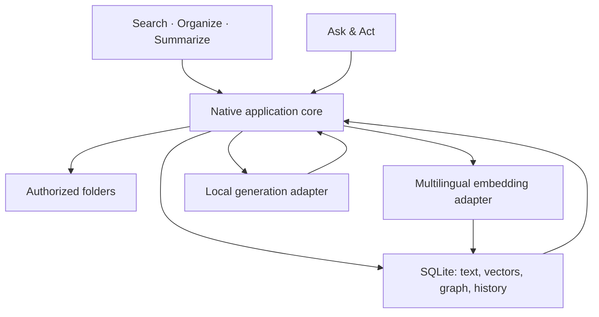

# Architecture

## Chosen shape

One repository contains the desktop UI, native core, shared contracts, fixtures, and docs. The target app uses Tauri 2, React/TypeScript, a Rust core, and SQLite with FTS5. The UI calls a narrow native command interface; the native core owns folder authorization, file reads/writes, persistence, and local inference lifecycle.

## Module boundaries

| Module        | Owns                                                                              | Does not own                                                     |
| ------------- | --------------------------------------------------------------------------------- | ---------------------------------------------------------------- |
| UI            | SOS entry points, file selection, source views, graph, preview, approval controls | Unrestricted filesystem access or authoritative approval records |
| Workspace     | Native folder picker, authorized roots, document identity, containment checks     | Model decisions                                                  |
| Indexing      | Extraction, chunking, content hashes, incremental invalidation                    | Original document copies                                         |
| Retrieval     | FTS5 + semantic candidate search, embedding-space isolation                       | Truth of generated answers                                       |
| Relationships | Typed edges, source evidence, confidence/provenance                               | Automatic edits to neighboring files                             |
| Actions       | Exact plans, expiry, current-file checks, approval, apply, history, undo          | Arbitrary generated shell commands                               |
| Providers     | Separate embedding and generation interfaces, local runtime lifecycle             | Direct filesystem mutation                                       |
| Model Lab     | Actual fixed-task results and measurement conditions                              | Synthetic performance claims                                     |

[Frozen contracts](contracts.md) define the cross-track boundary: `src/domain/contracts.ts` and `src-tauri/src/contracts.rs` declare the same shapes, native serialization uses camelCase, and `fixtures/contracts/contract-cases.json` pins the encodings both languages must produce. Failures cross the boundary as `{ code, message, details? }` so callers branch on a code rather than on prose. Workspace and document identities are stable across restarts and edits, source offsets are UTF-8 bytes bound to a document revision, and approval binds to a plan digest. Announce a contract change before merging it.

## Local AI

Embedding candidate: quantized multilingual-E5-small through an ONNX-compatible local adapter. Its model card includes Tagalog. A generic ONNX quantized export is available; validate it on both x64 Windows and Apple Silicon rather than assuming an x86-optimized export is portable.

Generation candidate: Qwen3 0.6B Q4_K_M for the footprint experiment, with another supported local model as the comparison candidate. Qwen3 lists Tagalog, but that does not establish this quantization's command/edit correctness. Compare on the same labelled tasks. A larger optional pack may be needed for stronger writing.

Target packaged runtime: llama.cpp as a platform-specific sidecar; Ollama may be an optional development adapter. Do not force users to install an external AI server for the consumer build. Do not add a separate command, summary, and graph LLM unless measurements justify it. MCP and hosted Jev can adapt the same tool/decision boundaries later.

RAG retrieves a bounded set of relevant source passages and sends them to the selected generative model. It changes supplied context, not model weights or download size. Filesystem actions are executed by native tools after validation and approval.

## Storage and invalidation

Original files remain in place. Store identifiers, paths, extracted text/chunks, vector data, graph evidence, model configuration, measurements, and bounded recoverable history in the OS application-data directory.

Start with exact vector search over the small demo corpus; choose an ANN index only after scale requires it. Store each embedding space by model revision, dimension, quantization, and preprocessing fingerprint. Different spaces are never searched together.

On save, move, rename, external modification, or deletion: update identity/path as appropriate, invalidate stale chunks/embeddings/edges/summary caches, and refresh affected local views. Failed writes do not update the index as though the change succeeded. The schema in `src-tauri/migrations/001_initial.sql` is a starting contract, not a connected database implementation.

## Approval and history

The native core creates an expiring plan tied to workspace identity, canonical target paths, expected file hashes, exact operations, and evidence. Approval applies to that exact plan. Changed targets or changed operations require a new preview. Reject path escape, symlink escape, collisions, and unsupported operations. Write via temporary file/replace where supported, record recoverable content, and handle rollback honestly. Undo also checks the current file hash so it cannot destroy unrelated external edits.

The native core issues plan identities and a digest over canonical, length-prefixed plan bytes, and accepts an approval only for a plan it issued whose digest the caller echoes. A batch records one durable outcome per operation — succeeded, failed, cancelled or not started — and Undo is whole-batch against current file state. The native writer (`src-tauri/src/writer.rs`) applies an approved plan, records one recoverable history entry per completed operation in SQLite, refreshes the affected index entries, and reverses a whole batch through Undo after the user confirms its preview (ADR 0008). A deletion stores the file's bytes in history before removing it, and Undo re-creates it only where nothing uses its name (ADR 0010). The UI cannot invent an approval token the native core treats as authoritative.

## Sources

- [Tauri project creation](https://v2.tauri.app/start/create-project/), [sidecars](https://v2.tauri.app/develop/sidecar/), [prerequisites](https://v2.tauri.app/start/prerequisites/).
- [SQLite FTS5](https://www.sqlite.org/fts5.html).
- [Multilingual E5 model card](https://huggingface.co/intfloat/multilingual-e5-small), [generic quantized ONNX export](https://huggingface.co/Xenova/multilingual-e5-small/blob/main/onnx/model_quantized.onnx).
- [Qwen3 language coverage](https://qwenlm.github.io/blog/qwen3/), [published Qwen3 variants](https://ollama.com/library/qwen3/tags), [Qwen RAG example](https://qwen.readthedocs.io/en/latest/framework/LlamaIndex.html).

Published model file sizes exclude runtime, tokenizer, context cache, app, index, and history. Document implementation measurements separately in `docs/status.md`.

## Issue #4 implementation boundary

The local-provider implementation lives in the pure-Rust `src-tauri/crates/folio-core` workspace member so contract, safety, retrieval, grounding, and interpretation tests do not require WebKitGTK. The Tauri crate is a thin command adapter: it authorizes a selected folder for reads, stores models/runtime files under the OS application-data directory, and returns typed results. It does not add a filesystem or shell plugin to the webview.

The embedding adapter is ONNX Runtime plus `tokenizers`, using the pinned multilingual E5-small int8 files, `query: ` and `passage: ` prefixes, attention-masked mean pooling, L2 normalization, a 512-token limit, and batches of at most 16 with no more than two intra-op threads. Its embedding-space fingerprint includes both file hashes, preprocessing, and the interim chunker revision. Query vectors carry their own space, and the exact in-memory vector index rejects a different fingerprint; native model selection, installation, and removal invalidate the cached snapshot/provider so vectors are never compared across revisions. Until #3 supplies persisted chunks and FTS5, `InterimTextChunker` and the Rust keyword path are explicit interim seams. Keyword results are labelled `keyword`, never `semantic`. Semantic evidence is provisionally gated at `MIN_SEMANTIC_SCORE` and keyword supplementation at `MIN_KEYWORD_SCORE`; those thresholds are development defaults, not accepted Q5–Q7 decisions.

The generation adapter launches a verified manifest runtime with a fixed argument vector, a random per-process API key, and `127.0.0.1` only. The API key is visible in the child process arguments; this is accepted for the loopback-only runtime and is not exposed as a remote service. Requests use the local OpenAI-compatible endpoint, bounded context/output settings, deterministic temperature/seed defaults, schema-constrained JSON, and Qwen thinking disabled. One provider instance permits one active generation; it exposes explicit unload, interrupts blocked reads on cancellation, reaps idle children, and unloads from the Tauri exit hook. Windows Job Object kill-on-close behavior has not been verified. Runtime/model installation is explicit, size- and SHA-256-verified, atomic, and confined to app data.

Summaries and answers are additive `GroundedResult` display data, structurally
assignable to the frozen `GroundedAnswer`, and never actions. Source passages
are UTF-8-byte evidence bound to a content hash, are delimited as untrusted
prompt data, and have their citations validated against the passages supplied
to that stage. Map/reduce limits return `partialSummary` with coverage rather
than silently truncating. A question with no retrieved evidence returns
`insufficientEvidence` without calling generation.

Interpretation receives only the user's request and a fixed schema/examples. Its deterministic resolver handles exact filename-stem matches, ambiguity, current-content exact-find checks, duplicate-path information, safe TXT/Markdown destinations, and unsupported delete. Candidate fallback is currently lexical/keyword-based; a cross-language target description that does not share searchable terms asks for clarification/selection until #3 supplies an indexed semantic target-candidate seam. It emits a typed `OperationProposal` only; #4 adds no approval, apply, write, ActionPlan, or Ripple path. The native #5 approval engine remains authoritative for any future filesystem change.

The Q5 completion gate and Q6/Q7 processing/competition policies remain provisional because those interview decisions were not accepted. The implementation records them as named limits and a single-generation policy, not as settled product vocabulary.

## Issue #8 Model Lab boundary

The harness is pure Rust in `folio-core::lab` and reports through a small `LabSink` interface with two concrete outputs: a JSON file (CI artifacts) and SQLite (the app). `src-tauri/src/lab_store.rs` writes the existing `benchmark_results` table from migration 001, with `schemaVersion` in both JSON columns and no new migration; `lab_commands.rs` holds the thin Tauri commands. `BenchmarkResult` is unchanged and `BenchmarkRecord` extends it additively ([contracts](contracts.md)).

A run measures one embedding model, then each requested generation model strictly one at a time, against a fresh disposable copy of the bundled corpus under `<app data>/model-lab/runs/<run id>/workspace`. The copy carries a marker, is reset per model, is hash-checked after each model, and is the only thing the lab reads or writes; user folders are never touched. Cases are labelled retrieval, interpretation, summary and edit proposal, and each is judged only by deterministic label checks, except summaries, which carry citation and string checks and stay `correctness: null` until a person appends a hash-bound review. There is no aggregate or self-graded score. An actual apply is recorded `notRun`: Model Lab never bypasses native approval.

Per case the llama-server process is restarted, the case runs once (the first request after the restart: `cold`) and then again at once on the same process (the immediate repeat). Startup is timed separately, prompt reuse (`cache_prompt`) is off for lab requests only, startup warmup keeps the runtime default, and the operating system's file cache is not controlled; all are recorded. Peak memory is a process-lifetime peak read from the operating system for a named process (`PeakWorkingSetSize` on Windows, `ri_lifetime_max_phys_footprint` on macOS, which leaves out the memory-mapped model file, `VmHWM` on Linux) or `null` with a reason. A run holds the generation slot, so user generation is refused with `providerBusy` while it runs. Model selection reuses `select_model`/`list_models`; the lab adds no second selection store.

**Evaluation candidates.** Candidate models live in `model-evaluation-candidates.json`, separate from the product manifest that `list_models`, `select_model` and onboarding read. `folio-core::lab::candidates` builds an isolated `ModelStore` for them under `<app data>/model-lab/candidates`, reusing the same HTTPS-only, size- and SHA-256-verified, atomic install. The candidate commands refuse product ids, take the shared install lock (a run holds it for its whole duration) and never touch product models or recorded results. Records carry `model.catalog` and `model.evaluationOnly`; promotion to a supported model would be a separate, user-confirmed change to the product manifest.

**CPU-only and backend.** `LabServerOptions` (additive, lab-only) adds `--n-gpu-layers 0 --device none` and captures the server's output; a provider built without it launches exactly as before. Each generation record keeps the requested setting (`gpuOffload`), the device listing and the backend and offload lines the server printed. The lab never infers CPU use from the absence of a GPU.
