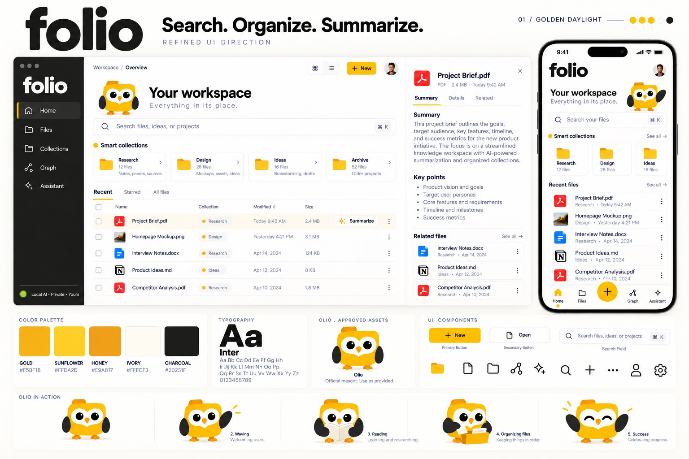

# Design system: Golden Daylight

Folio's visual direction is **Golden Daylight**: white surfaces, a charcoal sidebar, gold reserved for primary actions and brand moments, Inter for all UI text, and **Olio** — a folder-shaped owl — as the mascot. This document turns the brandbook into rules for the replacement UI (#6, #16 and the tickets that build on it).

The brandbook is a direction, not a spec of shipped features. Its screens contain illustrative files and features; [Product truth](#product-truth-in-the-mockups) lists where the MVP must differ. Product rules in `AGENTS.md` and `docs/product.md` win over this document.

## Principles

1. **Files first.** The file list and the selected document are the main content. Headings, mascot and decoration never push them below the first screen at 1024×768.
2. **Gold means act.** Gold fills mark the one primary action in a view, the active navigation item and brand moments. Do not use gold for body text, borders that carry meaning, or large backgrounds.
3. **Calm and readable.** Neutral warm grays, generous spacing and one accent. Contrast rules below are requirements, not suggestions.
4. **Honest status.** Every badge, status dot and progress bar reflects real state from an adapter. Nothing decorative may look like a status.
5. **Olio helps, never distracts.** The mascot appears in empty, onboarding, waiting and result moments — not in tables, toolbars or dense views.

## Color

### Brand palette

| Token               | Name      | Hex       | Use                                                                    |
| ------------------- | --------- | --------- | ---------------------------------------------------------------------- |
| `--brand-gold`      | Gold      | `#F5BF18` | Primary button fill, active nav indicator, brand dots, folder icons    |
| `--brand-sunflower` | Sunflower | `#FFDA2D` | Primary button hover, highlights                                       |
| `--brand-honey`     | Honey     | `#E9A817` | Primary button pressed, illustration shading                           |
| `--brand-ivory`     | Ivory     | `#FFFCF3` | Sidebar text, dark-theme text, Olio's dark-mode disc                   |
| `--brand-charcoal`  | Charcoal  | `#20231F` | Primary text, sidebar background, text on gold, focus ring on light UI |

### Semantic tokens (light theme)

| Token                    | Value     | Use                                                  |
| ------------------------ | --------- | ---------------------------------------------------- |
| `--color-bg`             | `#FFFFFF` | Window canvas (white, not the brandbook's ivory)     |
| `--color-surface`        | `#FFFFFF` | Cards, tables, panels, inputs                        |
| `--color-surface-muted`  | `#FAF7EE` | Table header, hovered rows, secondary panels         |
| `--color-selected`       | `#FFF6D6` | Selected row and selected card background            |
| `--color-border`         | `#ECE8DC` | Dividers, card and input borders (decorative)        |
| `--color-border-strong`  | `#8A8C86` | Borders that identify a control, such as checkboxes  |
| `--color-text`           | `#20231F` | Primary text                                         |
| `--color-text-secondary` | `#5C5F59` | Metadata: sizes, dates, paths                        |
| `--color-text-tertiary`  | `#6B6E68` | Placeholders, captions, helper text                  |
| `--color-text-on-gold`   | `#20231F` | Text and icons on gold, sunflower or honey           |
| `--color-link`           | `#8A6500` | Text links and gold-tinted text on light surfaces    |
| `--color-success`        | `#2E7D32` | Success text and icons                               |
| `--color-success-dot`    | `#57B947` | "Ready" status dot (always paired with a text label) |
| `--color-danger`         | `#B42318` | Errors, destructive actions                          |
| `--color-danger-bg`      | `#FEF3F2` | Error notice background                              |
| `--color-warning-bg`     | `#FFF6D6` | Warning notice background, with `--color-text`       |
| `--color-focus`          | `#20231F` | Focus ring on light surfaces                         |
| `--sidebar-bg`           | `#20231F` | Sidebar                                              |
| `--sidebar-item-active`  | `#2E312C` | Active nav item background                           |
| `--sidebar-text`         | `#FFFCF3` | Sidebar labels                                       |
| `--sidebar-text-muted`   | `#B8BAB4` | Sidebar secondary text                               |
| `--sidebar-focus`        | `#F5BF18` | Focus ring inside the sidebar                        |
| `--graph-edge`           | `#5C5F59` | Graph lines (follows `--color-text-secondary`)       |
| `--graph-edge-ai`        | `#5B5BD6` | Dashed lines for AI connections (indigo, not gold)   |
| `--graph-node-rim`       | `#5C5F59` | Rim of a file node on the graph                      |

### Contrast rules

Measured with the WCAG 2.x formula on the white canvas and surfaces:

| Pair                   | Ratio   | Allowed for                                                    |
| ---------------------- | ------- | -------------------------------------------------------------- |
| Charcoal on white      | 15.89:1 | All text                                                       |
| Charcoal on gold       | 9.34:1  | Button labels and icons on gold                                |
| `#5C5F59` on white     | 6.49:1  | Secondary text, graph lines and node rims                      |
| `#6B6E68` on white     | 5.18:1  | Tertiary text and placeholders                                 |
| `#8A6500` on white     | 5.33:1  | Links                                                          |
| `#5B5BD6` on white     | 5.37:1  | Dashed AI graph lines only — never text                        |
| `#B8BAB4` on charcoal  | 8.11:1  | Sidebar muted text                                             |
| Gold on charcoal       | 9.34:1  | Active indicator and focus ring in sidebar                     |
| `#2E7D32` on `#FAF7EE` | 4.79:1  | Diff "+" marker on an added line                               |
| `#B42318` on `#FEF3F2` | 6.05:1  | Error text, diff "−" marker on a removed line                  |
| `#8A8C86` on white     | 3.40:1  | Control borders only — **never text**                          |
| **Gold on white**      | 1.70:1  | **Decoration only** — never text, focus or a meaningful border |
| **Honey on white**     | 2.08:1  | **Decoration only**                                            |

Never put white text on gold. Never rely on color alone: status dots, collection dots and badges always have a text label.

### Dark theme (derived, not in the brandbook)

The brandbook only shows a light theme. #16 requires dark mode, so these values are a proposal to review visually before shipping. Every light-theme token has an entry; "unchanged" means the light value is reused on purpose.

| Token                    | Dark value | Note                                       |
| ------------------------ | ---------- | ------------------------------------------ |
| `--color-bg`             | `#161815`  |                                            |
| `--color-surface`        | `#20231F`  |                                            |
| `--color-surface-muted`  | `#2A2D28`  |                                            |
| `--color-selected`       | `#3A3220`  |                                            |
| `--color-border`         | `#3A3D37`  |                                            |
| `--color-border-strong`  | `#8A8C86`  | Unchanged                                  |
| `--color-text`           | `#FFFCF3`  |                                            |
| `--color-text-secondary` | `#B8BAB4`  |                                            |
| `--color-text-tertiary`  | `#A3A59F`  |                                            |
| `--color-text-on-gold`   | `#20231F`  | Unchanged: gold buttons keep charcoal text |
| `--color-link`           | `#F5BF18`  |                                            |
| `--color-success`        | `#6CC66F`  |                                            |
| `--color-success-dot`    | `#57B947`  | Unchanged                                  |
| `--color-danger`         | `#F97066`  |                                            |
| `--color-danger-bg`      | `#3D1F1C`  |                                            |
| `--color-warning-bg`     | `#3A3220`  | Same as dark `--color-selected`            |
| `--color-focus`          | `#F5BF18`  |                                            |
| `--sidebar-bg`           | `#111310`  |                                            |
| `--sidebar-item-active`  | `#2A2D28`  |                                            |
| `--sidebar-text`         | `#FFFCF3`  | Unchanged                                  |
| `--sidebar-text-muted`   | `#B8BAB4`  | Unchanged                                  |
| `--sidebar-focus`        | `#F5BF18`  | Unchanged                                  |
| `--graph-edge`           | `#B8BAB4`  | Follows `--color-text-secondary`           |
| `--graph-edge-ai`        | `#9B8AFB`  | Lighter indigo; gold stays for actions     |
| `--graph-node-rim`       | `#B8BAB4`  | Follows `--color-text-secondary`           |

Dark-theme contrast, measured with the same formula:

| Pair (dark)                                       | Ratio          | Allowed for                    |
| ------------------------------------------------- | -------------- | ------------------------------ |
| `#FFFCF3` on bg / surface / muted                 | ≥13.61:1       | All text                       |
| `#FFFCF3` on selected and warning-bg `#3A3220`    | 12.35:1        | Selected rows, warning notices |
| `#FFFCF3` on danger-bg `#3D1F1C`                  | 14.51:1        | Error notice body text         |
| `#B8BAB4` on surface / muted / selected           | ≥6.47:1        | Secondary text                 |
| `#A3A59F` on surface / muted / selected           | ≥5.09:1        | Tertiary text and placeholders |
| Gold on surface / muted / selected                | ≥7.45:1        | Links, focus ring              |
| `#F97066` on surface / muted / danger-bg          | ≥5.01:1        | Error text                     |
| `#6CC66F` on surface / muted                      | ≥6.61:1        | Success text                   |
| `#8A8C86` on surface / muted                      | ≥4.11:1        | Control borders                |
| Charcoal on gold                                  | 9.34:1         | Button labels and icons        |
| `#FFFCF3` / `#B8BAB4` on sidebar-active `#2A2D28` | 13.61 / 7.13:1 | Active nav item                |
| Gold on sidebar `#111310` / active `#2A2D28`      | 10.98 / 8.21:1 | Sidebar indicator and focus    |
| `#B8BAB4` on surface                              | 6.47:1         | Graph lines and node rims      |
| `#9B8AFB` on surface / muted                      | 5.62 / 4.93:1  | Dashed AI graph lines          |

Define dark values under `@media (prefers-color-scheme: dark)` and a `data-theme="dark"` override. The sidebar's **Theme** switch cycles System → Light → Dark. System follows the OS. The choice is remembered on this device (`src/app/theme.ts`) and applied before the first render. Any new token or pair must be added to both contrast tables.

## Typography

**Inter** for all UI text, bundled with the app (for example via `@fontsource/inter` or font files in `src/assets/fonts/`). Never load fonts from Google Fonts or another CDN — the app must work offline.

The **folio wordmark** is a custom heavy rounded logotype, not Inter. Use it only as an SVG asset (`src/assets/brand/folio-wordmark.svg`, still to be exported — see [Assets](#assets)); do not try to recreate it with CSS.

| Token             | Size / line height                   | Weight  | Use                                                  |
| ----------------- | ------------------------------------ | ------- | ---------------------------------------------------- |
| `--text-display`  | 32 / 40                              | 700     | Page title ("Your workspace")                        |
| `--text-title`    | 20 / 28                              | 600     | Panel title (file name in the detail panel)          |
| `--text-heading`  | 16 / 24                              | 600     | Section headings ("Smart collections", "Key points") |
| `--text-body`     | 14 / 20                              | 400     | Body, table cells, summaries                         |
| `--text-label`    | 14 / 20                              | 500     | Buttons, nav items, tabs                             |
| `--text-small`    | 12 / 16                              | 400–500 | Metadata, badges, captions — minimum size            |
| `--text-overline` | 12 / 16, +0.12em tracking, uppercase | 500     | Rare section labels only                             |

The tagline style under the page title ("Everything in its place.") uses `--text-heading` at weight 400 with `0.04em` letter spacing in `--color-text-secondary`. No text below 12px. Use `font-variant-numeric: tabular-nums` for sizes, dates and counts in tables.

## Spacing, radius and elevation

- **Spacing scale (4px base):** 4, 8, 12, 16, 20, 24, 32, 40, 48. Page padding 24–32px; card padding 16px; table row height 48px.
- **Radius:** 6px badges and checkboxes · 8px buttons and nav items · 10px inputs and search · 12px cards and panels · 999px pills.
- **Elevation:** surfaces are mostly flat with a 1px `--color-border`. Floating layers (menus, modals, command palette) use `0 8px 24px rgb(32 35 31 / 0.12)`. No glows.

## Layout

Desktop window, three regions as in the brandbook:

| Region  | Width                                 | Content                                                         |
| ------- | ------------------------------------- | --------------------------------------------------------------- |
| Sidebar | 240px, or a 64px icon rail            | Wordmark, navigation, local AI status at the bottom             |
| Main    | Flexible, min 420px beside the reader | Breadcrumb, page header, global search, collections, file table |
| Reader  | Resizable, 320px to 60% of the window | Selected file: tabs Summary · Details · Related, actions        |

The sidebar, the list and the reader follow the space actually available — computed from the app's own measured width in `src/app/shellLayout.ts` — rather than a single fixed window breakpoint (#67):

- **Resizable reader:** a vertical separator (`role="separator"`, keyboard-operable with Left/Right, Home/End) between the list and the reader lets it be dragged from 320px up to 60% of the window, with the list keeping at least 420px. The width is remembered per device (`folio.reader.width`); if storage fails, the default (380px) is used.
- **Reader beside the list (split):** whenever the list's 420px minimum and the reader's width both fit beside the sidebar, they sit side by side. This applies on Home, Graph, Ask & Act, Activity and Organize (from a file named in an entry or suggestion) — not only Home.
- **Reader over the list (overlay):** once they don't both fit (even with the sidebar collapsed to its rail), the reader becomes an overlay sliding in from the right, with Back and Escape. The list stays mounted behind it, keeping its scroll position and focus; closing it returns focus to the row that opened it. See [ADR 0012](adr/0012-reader-overlay-instead-of-full-width-replacement.md) for why this replaced the earlier full-width "replace the list" behaviour.
- **Sidebar labels:** shown whenever there's room for them plus the main area's 480px minimum (and the reader, if one is open) — not from a fixed 1180px window width down. A wide window keeps labels even with the reader open; a narrow one with the reader open collapses to the icon rail sooner than it used to.
- **File table columns** drop one at a time as the table's own measured width shrinks, in priority order — size, then modified, then type, then location (location then moves under the name) — so the file name is never the column that gets crushed (`src/app/fileColumns.ts`).
- At **1280×850** and **1024×768**, the file list and the open document are both on the first screen, without scrolling: Home's mascot, tagline, pinned/recent strips and the empty-collections placeholder give way to the list and reader while a file is open.
- The page header (mascot + "Your workspace") is compact: at most ~96px tall on Home and absent on other pages.
- Below **768px height**, down to the **600px minimum** in `tauri.conf.json`, the Home page header is hidden and the collection cards collapse to one horizontally scrolling row. The search field and file table tabs stay, and the file table keeps at least five rows visible.
- At narrow Home widths (around 400px), the Folder/Type/Modified filters wrap as label-above-control pairs instead of a label-beside-select row, and the search field's ⌘K/Ctrl K hint gives up its room so the placeholder isn't cut off.

The phone frame in the brandbook is a future direction. Phone packaging is outside the MVP.

## Navigation

The brandbook sidebar shows Home · Files · Collections · Graph · Assistant. Folio keeps **Search**, **Organize** and **Summarize** reachable without the assistant. The navigation follows [ADR 0011](adr/0011-activity-organize-and-model-lab-in-navigation.md):

| Nav item             | Contains                                                                                     | SOS role                      |
| -------------------- | -------------------------------------------------------------------------------------------- | ----------------------------- |
| Home                 | The file browser: search, filters, pinned folders, recent files, file table with row actions | Search (journey A entry)      |
| Organize             | Collections, analyze, suggestions, duplicates (journey B)                                    | Organize                      |
| Graph                | Relationships from a file, folder or topic, with evidence                                    | Explore related files         |
| Ask & Act            | The full-page assistant, Olio (journey C)                                                    | Supporting route, not the app |
| Activity             | Folio's recorded changes, with safe Undo                                                     | Accountability                |
| Model Lab (settings) | Model setup and comparisons                                                                  | Settings                      |

There is no Files tab (#42, ADR 0010). Home is the file browser, like a phone's Files app: every file, each with a ⋯ menu (Open, Rename…, Move to folder…, Show related). The document panel's header has the same menu. Rename and Move use the same exact preview, Approve and Undo as Organize; nothing changes in one click.

Search appears only on Home, centred under the header, and ⌘K or Ctrl K opens Home from any page (#43). Summarize lives in each file's **Summary** tab, with a "Summarize this file" button there, or from Ask & Act (#20). It isn't a row action.

**Home layout**, top to bottom:

- the header (Olio and "Your workspace");
- the centred search field, with the Folder, File type and Modified filters under it;
- the folder strip;
- pinned folders and recent files, each shown once there are some;
- the collections overview, which gives way to pins and recent files;
- the file table.

The file list stays on the first screen at 1280×850, and at 1024×768 with the reader open (#33). An **Ask Olio** launcher with a dismissible greeting is planned (#37).

The brandbook labels the Organize item "Collections". Folio uses **Organize** so the nav names the SOS capabilities (`docs/product.md`); "Collections" is the section heading inside the Organize page.

Active item: `--sidebar-item-active` background, 3px gold bar on the left edge, `aria-current="page"`.

## Components

**Buttons**

- _Primary_: gold fill, charcoal label, optional leading icon ("+ New"). Hover sunflower, pressed honey, disabled 40% opacity with `not-allowed`. One primary button per view.
- _Secondary_: white fill, 1px `--color-border-strong`, charcoal label ("Open").
- _Ghost/row action_: no border until hover ("✦ Summarize" in the table row).
- Minimum hit area 32px high (40px for primary).

**Search field**

- Only on Home: horizontally centred under the page header, at most 640px wide, and full width in narrow windows. Search icon on the left, placeholder "Search files, ideas, or projects", shortcut hint on the right. Other pages have no search field, and the query filters only Home's list.
- The shortcut is platform-aware: **⌘K** on macOS, **Ctrl K** on Windows. From any page it opens Home and focuses the field.
- In a narrow window with a document open, the field stays above the reader.
- Opens results inline; results follow #19 (excerpt, path, page, match method).

**Collection cards**

- Folder icon, name, file count, one-line description, chevron. White surface, 12px radius, 1px border; hover lifts to `--color-surface-muted`.
- See [Product truth](#product-truth-in-the-mockups) before labelling anything "smart".

**File table**

- Tabs: Recent · Starred · All files.
- Columns: checkbox, type icon + name, collection badge, modified, size, actions (`⋯`). Sortable headers show a sort icon and `aria-sort`.
- Selected row uses `--color-selected` plus `aria-selected="true"`, and is never only a color change for keyboard users (focus ring on the row).
- Long names truncate with an ellipsis; the full name and path are available on hover and in the detail panel.

**Collection badge**: pill, `--color-surface-muted` background, 8px colored dot + text label.

**Detail panel**

- Header: file-type icon, file name (`--text-title`), metadata line (type · size · modified), close button.
- Tabs: **Summary** (summary text + key points, each citing its source passage) · **Details** (path, location, history) · **Related** (related files with relationship type and evidence, #21).
- A summary is always shown as a generated preview, never as a saved file.

**Status pill** (sidebar bottom): dot + text, for example "Local AI · Private · Yours". The text and dot come from real runtime state — see Product truth.

**Exact previews** (#45, `src/views/PlanReview.tsx`)

- _Text diff_: a table with Before and After line numbers. Removed lines have a `−` marker in `--color-danger` on `--color-danger-bg`; added lines a `+` marker in `--color-success` on `--color-surface-muted` with a 3px success bar. Each marker also has a spoken "Removed"/"Added" label, so color is never the only signal. A diff too large to compute shows the full new text instead.
- _Needs review_: Ripple candidates are cards with a "Needs review" badge, the path, the reason, how Folio knows, and the passages as quotes. Only model or embedding provenance adds an "AI" badge. Never word a candidate as updated.
- The Edit text dialog uses the wide modal (`modal-wide`, 760px) and can't be closed while a change is being saved.

**Notices and errors**: follow #18. Inline notice = icon + plain-language message + one action; danger uses `--color-danger` text on `--color-danger-bg`.

**Graph concept map** (#45)

- A Map / List switch (`aria-pressed`, bold and outlined when pressed). Both are drawn from the same pairs; the list always shows every connection and is never a fallback.
- Edges: links and identical copies are **solid**. A link has an arrowhead at the linked file (at both ends when two files link each other); an identical copy is a **double line**. Connections a model found (similarity, shared-fact candidates) are **dashed** in `--graph-edge-ai` (indigo; gold stays reserved for actions) and labelled **"AI"**, and exist only when a model produced them. The selected file's edges are labelled in text ("Link", "Identical copy", "AI · Similar content") when they are long enough to hold a label; zooming in lengthens them. Line style and text carry the meaning, never colour alone.
- Nodes: a 9px circle with a `--graph-node-rim` rim and the file name below it, truncated to 24 characters (full name in the accessible name, full path in the tooltip). The selected node has a gold fill, a heavier `--color-text` rim and a bold label; gold is decoration here, the rim and `aria-pressed` carry the state. Keyboard focus draws a 2px `--color-focus` ring outside the node.
- Keyboard: one Tab stop (a roving `tabindex`). Arrow keys move to a connected file within 60° of the arrow (see Arrow choice); when there is none, focus stays and "No connected file that way" is announced. Page Up/Page Down go through every file by path, Home/End to the first and last. Enter or Space opens the file in the reader; Escape deselects. + / − zoom and 0 fits the map.
- Arrow choice: among connected files within ±60° of the arrow, the lowest `distance / cos(angle)` wins, so a file straight ahead beats a slightly nearer diagonal one (100px ahead scores 100; 85px at 45° scores 120), while a much nearer diagonal one still wins.
- Pointer: drag the background to pan, drag a file to move and pin it. A plain scroll wheel scrolls the page; Ctrl or ⌘ + wheel zooms around the pointer, and a trackpad pinch (sent as Ctrl + wheel by Chromium and WebKit) or a two-finger touch pinch zooms too. The zoom buttons over the map do the same as + / − / 0.
- The layout is computed at once and deterministically (d3-force with a seeded random source), so nothing animates and reduced motion needs no special case. Zoom scales positions only; labels keep their size.
- The legend lists links and identical copies with a checkbox each. AI kinds appear only when such connections exist; otherwise one line says they will appear when a model produces them. The zoom controls float over the map with the floating-layer shadow.

## Icons

Outline icons on a 24px grid, 1.5–2px rounded strokes, charcoal on light surfaces — the brandbook set matches **Lucide**. Install `lucide-react` from npm so icons are bundled; no icon CDN. Icon-only buttons need an `aria-label` and a tooltip. File types use coloured tiles at 20–24px, as in the brandbook: PDF red (`--file-pdf`), plain text blue (`--file-text`), and Markdown charcoal in light mode and ivory in dark mode. Each tile has a white or charcoal Lucide glyph at ≥4.5:1. The tiles are ≥3:1 against the page and panel surfaces in both themes, but in dark mode the PDF and text tiles drop below that on hovered and selected rows (down to 2.62:1). That's acceptable because they're decorative: the file name and type text carry the meaning. Brightening them would push the white glyphs below 4.5:1. Brand logos (Acrobat, Word, Notion) are not used.

## Olio, the mascot

Olio is a yellow folder-owl with ivory face mask, black eyes and wings, and orange beak and feet. **Use the official artwork as provided** — do not redraw, recolor, stretch, rotate or add effects.

### Assets

The source sheets are in `olio-asset-pack.zip`: `olio-main-design.png`, `olio-angles-and-actions.png` and `olio-more-actions.png`. The pack is kept outside Git and is ignored by `.gitignore` until the team decides whether source sheets belong in the repository; get it from the design owner and do not commit it.

The twelve poses in the table below are cleaned and sliced into `src/assets/olio/olio-<pose>-<px>.png`:

- The speckled low-alpha background was removed, interiors made fully opaque and anti-aliased edges kept. The artwork itself is unchanged.
- Each pose is exported at 96, 192 and 320px: 2× of the 48, 96 and 160px display sizes. There is no separate 1× set, because the source poses are only about 300px and browsers downscale the 2× files well. Every file is under 100 KB.
- Use them only through the `<Olio pose size>` component (`src/ui/Olio.tsx`). A test fails if a pose is missing at any size.

Still to produce: **the wordmark.** Export the folio wordmark as `src/assets/brand/folio-wordmark.svg`, in a charcoal version for light surfaces and an ivory version for the sidebar. Until then the sidebar shows an interim Inter 800 wordmark.

### Poses and where they appear

| Pose                   | Use in the app                                        |
| ---------------------- | ----------------------------------------------------- |
| Default (front)        | Home header, about screen                             |
| Waving                 | Onboarding welcome (#14)                              |
| Reading a book         | Summary generating, indexing in progress              |
| Organizing a box       | Organize analyzing, organize preview                  |
| Holding a document     | Summary ready, "here's what I found"                  |
| Thinking (dots)        | Waiting for a model response                          |
| Confused (?)           | No search results, ambiguous file selection           |
| Worried (⚠)            | Recoverable errors (alongside the real error message) |
| Success (✓)            | Approved change saved, onboarding complete            |
| Peeking                | Empty folder or empty collection                      |
| Celebrating            | First indexing finished                               |
| Sleeping (eyes closed) | No model installed; AI features asleep until set up   |

### Rules

- Olio is **decorative**: `alt=""` (or `aria-hidden`) because the adjacent text carries the meaning. Never put information only in the mascot's pose.
- One Olio per view, at most. Never inside tables, menus, toolbars, notices in dense panels or the file reader.
- Sizes: 48px inline, 96px in page headers and panels, 160px in empty states and onboarding.
- On dark surfaces Olio sits on an ivory disc (`--olio-backdrop`), because its charcoal wings disappear against the dark theme. Light surfaces have no disc.
- Errors stay serious: the worried pose accompanies a clear message and recovery action; it never replaces them.
- Respect `prefers-reduced-motion`: any pose animation (for example a gentle bob while indexing) stops when reduced motion is requested.

## Voice

Short, friendly and plain. Name the thing and the next step: "No files match 'deadline'. Try another word or search all folders." Never use developer terms in the UI (for example "adapter", "track T2" or "provider disconnected"). UI labels are English; document content, search and answers support English, Filipino and Taglish.

## Product truth in the mockups

The brandbook shows illustrative content. The MVP must stay within product scope:

| Mockup element                                | MVP rule                                                                                                                                                                            |
| --------------------------------------------- | ----------------------------------------------------------------------------------------------------------------------------------------------------------------------------------- |
| "Smart collections"                           | Automatic virtual collections are a stretch goal. Until they exist, label the section "Collections" and show only real virtual collections. Never imply files were moved or copied. |
| `.docx` and `.png` files with summaries       | MVP reads TXT, Markdown and text-based PDF. Other types may be listed if the workspace adapter lists them, but Summarize is disabled for them with a reason.                        |
| "✦ Summarize" row action                      | Produces a cited preview. Saving it as a new document is a separate approved create action.                                                                                         |
| "+ New"                                       | Creates a TXT/Markdown document through preview and approval, not a silent write.                                                                                                   |
| "Related files"                               | Show relationship type and evidence (#21). Fixture or explicit links are never labelled as model inference.                                                                         |
| "Local AI · Private · Yours" with a green dot | Shows real runtime state: e.g. "Local AI ready", "Indexing 45%", "No model — Set up". Green dot only when a model is actually ready.                                                |
| User avatar                                   | Folio has no accounts. Replace with a settings or Model Lab button.                                                                                                                 |
| ⌘K hint                                       | Ctrl K on Windows.                                                                                                                                                                  |
| Phone layout                                  | Future direction; outside the MVP.                                                                                                                                                  |
| File names and dates                          | Placeholder content. The browser preview must say it uses sample files.                                                                                                             |

## Accessibility checklist

- Text contrast at least 4.5:1; control boundaries, icons and focus indicators at least 3:1. Status dots (`--color-success-dot` is 2.49:1 on white) are exempt only because they always have a text label; never drop the label or change the dot away from the brand green to tidy it up.
- Visible 2px focus ring with 2px offset on every interactive element (charcoal on light, gold on the sidebar).
- Keyboard: Tab order follows layout; arrow keys move through table rows and tabs; Escape closes panels and modals; focus returns to the trigger.
- Programmatic state: `aria-current` for nav, `aria-selected` for rows and tabs, `aria-sort` for sorted columns.
- Status changes (search results, indexing, summaries, save outcomes) are announced through a polite live region.
- Layout works at 1280×850, 1024×768, 700px and 200% zoom with long English, Filipino and Taglish names and paths.
