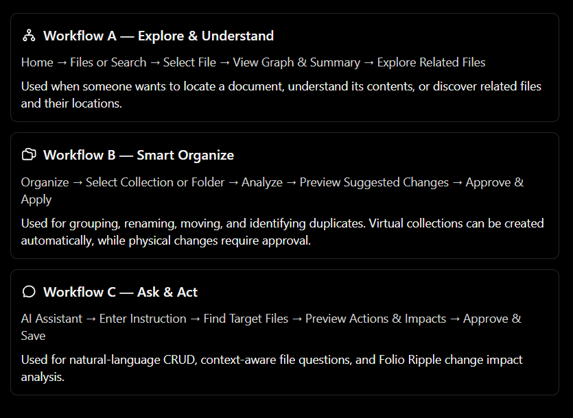

# SOS workflows

The reference image defines three user journeys. Preserve their independent entry points.

| Journey                  | Steps                                                                                             | Purpose                                                                              |
| ------------------------ | ------------------------------------------------------------------------------------------------- | ------------------------------------------------------------------------------------ |
| A — Explore & Understand | Home → Browse or Search Files → Select File → View Graph & Summary → Explore Related Files        | Locate documents, understand contents, discover connections and locations.           |
| B — Smart Organize       | Organize → Select Collection or Folder → Analyze → Preview Suggested Changes → Approve & Apply    | Group virtually; suggest names and destinations; identify exact duplicates.          |
| C — Ask & Act            | AI Assistant → Enter Instruction → Find Target Files → Preview Actions & Impacts → Approve & Save | Natural-language create/read/edit/rename/move, grounded questions, and Folio Ripple. |

The updated product context (2026-10-09) adds workflows that sit beside these journeys rather than replacing them. They are named, not lettered, because their source used letters A–E that clash with the journeys above; issues refer to journey B as Smart Organize and journey C as Ask & Act.

| Workflow               | Steps                                                                                                 | Notes                                                                                       |
| ---------------------- | ----------------------------------------------------------------------------------------------------- | ------------------------------------------------------------------------------------------- |
| Deterministic search   | Home → Type a name or word → Filter by folder, file type or modified date → Open or preview a file    | Part of journey A. Works without a model; never routed through one (#33, #43).              |
| AI deep search         | Ask & Act → Choose a scope → Describe the file → Review files, paths, excerpts and reasons → Open one | Needs a local model. Says when indexing is incomplete or a file type is unsupported (#36).  |
| AI-assisted organizing | Ask & Act → Describe the organization → Review the exact plan → Approve → Changes appear in Activity  | Ends in the same preview and approval as journey B; Organize stays its own page (ADR 0010). |
| Relationship graph     | Graph → Start from a file, folder or topic → Explore connections and evidence → Open related files    | Confirmed links are shown apart from suggested ones (#40).                                  |
| Activity and recovery  | Activity → Pick an entry → See what changed, when, and before/after paths → Undo when it's safe       | Lists only what Folio recorded as changed; previews and analyses never appear (#34).        |

## Shared request pipeline

1. Receive the request, including English, Filipino, or Taglish.
2. Find target documents in authorized folders. Present choices if identity is ambiguous.
3. Understand relevant contents using located passages.
4. Discover related documents through candidate retrieval, explicit links, and graph traversal.
5. Prepare the edit/action preview and Ripple evidence. Treat findings as review candidates.
6. Ask approval for the exact plan. Reject a stale plan if a target changed.
7. Apply the approved operations, record history, and refresh the affected local index and graph.

## Concrete demonstration

Request: **“Hanapin yung project plan at palitan ang deadline na October 20 to October 23.”**

Folio finds `project-plan.md`, shows the supporting deadline passage, and discovers `meeting-notes.md` and `submission-checklist.md`. The preview changes only the target plan. Ripple flags old-deadline passages in the two other files. After approval, the target is saved and its local index is refreshed. The two review candidates remain unchanged until separately reviewed. Undo restores the target only if its current state still matches the applied change.

## Summarize remains core

Selecting a file offers a source-grounded individual summary. The assistant can request the same action with **“Ibuod itong document.”** Saving a generated summary as a new document is a separate approved create operation. Project-wide summaries are a stretch goal with explicit coverage and source references.

## Failure behavior

No model: browsing, keyword search, and native operations remain available; AI-dependent actions show setup guidance. No matching evidence: show the lack of evidence rather than inventing an answer. Ambiguous files: ask the user to choose. Permission loss, rename collision, external edit, or failed save: show the error and retain the preview without claiming success.
